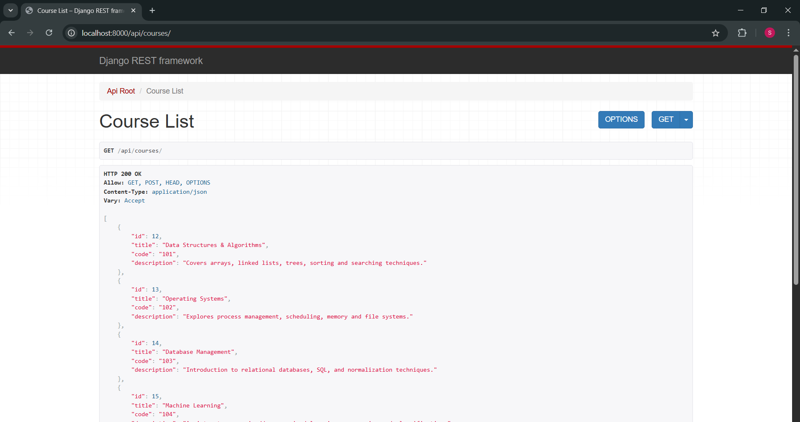
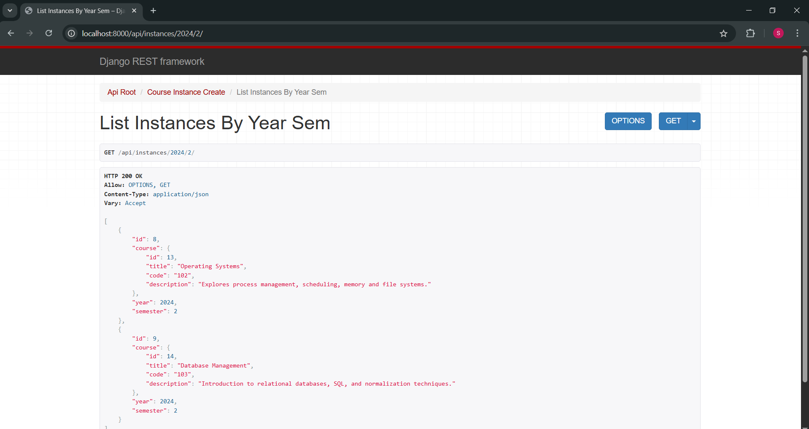
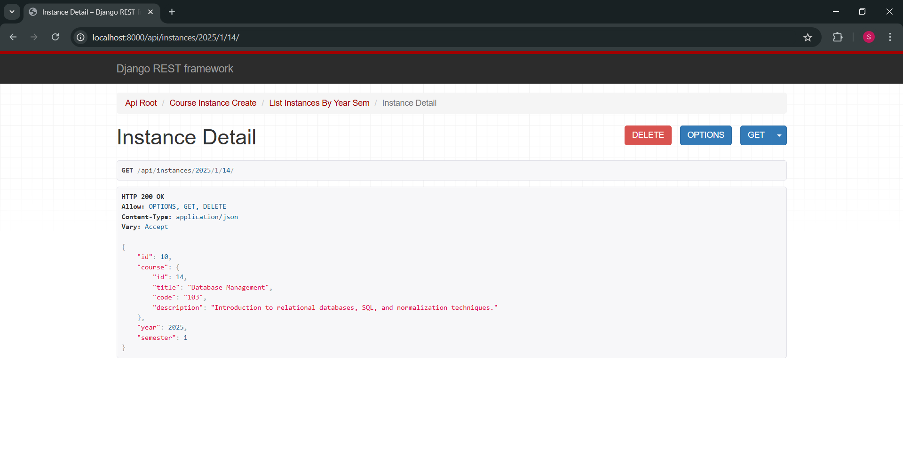

# IIT ASC Course Manager - Backend

This is the Django REST backend for managing courses and their delivery instances for IIT ASC.

## Features

- Django REST Framework-based API
- CRUD operations for:
  - Courses
  - Course Instances (filtered by year and semester)
- SQLite database for development
- CORS enabled for local frontend development

## API Endpoints

- `POST   /api/courses` — Create a course
- `GET    /api/courses` — List all courses
- `GET    /api/courses/<id>` — Get details of a course
- `DELETE /api/courses/<id>` — Delete a course

- `POST   /api/instances` — Create a course instance
- `GET    /api/instances/<year>/<semester>` — List instances for a given year and semester
- `GET    /api/instances/<year>/<semester>/<course_id>` — Get details of a specific instance
- `DELETE /api/instances/<year>/<semester>/<course_id>` — Delete an instance

## Local Setup

```bash
# Create virtual environment
python -m venv venv
venv\Scripts\activate  # For Windows
# source venv/bin/activate  # For Mac/Linux

# Install dependencies
pip install -r requirements.txt

# Apply migrations
python manage.py migrate

# Start server
python manage.py runserver

## Run Docker image
docker build -t course-manager-backend .
docker run -p 8000:8000 course-manager-backend

# To run with frontend
docker-compose up --build


## Application Screenshots

<div align="center">
  
  
  
  
</div>
